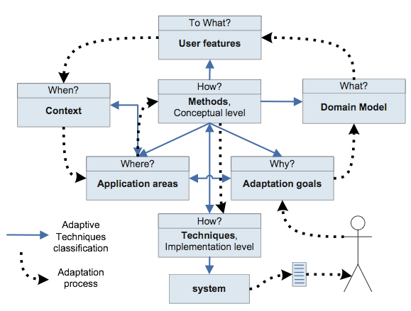

# Adaptation
Because everyone is different
- Non-adaptive systems = Do not depend on environmental factors and history
 - Like preferences
 - Algorithms like obstruction avoidance
- First order adaptive systems = adaptation rules are fixed
 - Remembers what you like
- Second order adaptive systems = adaptation rules are itself adaptive
 - Changes how it remembers

### Pros
- Better usability satisfaction
  - Boring actions are automated
  - Effective display of information, less actions needed
- Economical benefits? <!--TODO: Slide 16 lecture 1 -->

### Cons

The user:
- provides data
- edits the user-model (optionally)
- get adaptation effects

*Question loop*

# Terminology
- user-based adaptive system = adapt to user
- web-based = request response paradigm

# Architecture
