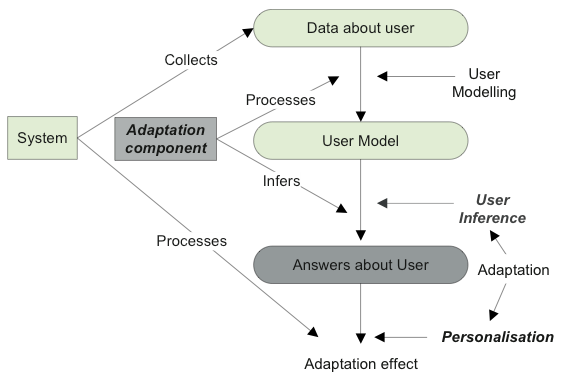
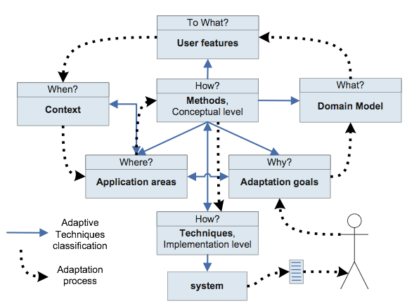

# Adaptation
Because everyone is different
- Non-adaptive systems = Do not depend on environmental factors and history
  - Like preferences
  - Algorithms like obstruction avoidance
- First order adaptive systems = adaptation rules are fixed
  - Remembers what you like
- Second order adaptive systems = adaptation rules are itself adaptive
  - Changes how it remembers

Examples: encyclopedia, documentation, shopping sites, airline reservation

#### Pros
- Better usability satisfaction
  - Boring actions are automated
  - Effective display of information, less actions needed
- Economical benefits? <!--TODO: Slide 16 lecture 1 -->

#### Cons
- Its personal and may not help everyone
- Information bubble / censorship

# Architecture
Store information:
- forward reasoning: register conclusions to a user-model, adapt based on user-model.
- backward reasoning: store rules and draw conclusions when needed.
- client side vs server side

Adaptive approach:
- adaptable: The user changes his model explicitly
- adaptive: The system learns the model deductively

## The user model

- Stable characteristics
  - Background; ask explicitly for stereo model
  - Experience; hyperspace experience
  - Individual traits; extravert/introvert, cognitive (learning) styles, cognitive performance
  - Environment; platform, location(, emotional state)
- Evolving traits:
  - Knowledge; initialize with stereo model. scalar model (one scale) vs structural model.
  Overlay modeling; knowledge propagates through structure.
  Dimensions; Boolean, Qualitative, Probability, Estimate, Multi valuable
  - Interests; track interest in concepts, follow synonyms and semantic links, clustering
  - Goals; system assumes one goal, show and let the user modify the goal.
- edits the user-model (optionally)
- get adaptation effects

#### User model as Bayesian network
- P(A|given B)
- Advantages
  - application domain in single graph
  - handling uncertainty
- Disadvantages
  - heavy to implement, complex

#### Generic user modeling systems (GUMS)
- Advantages:
  - Portability/scalability
  - Cheaper development
- Disadvantages:
  - Can contain redundant information
  - Communication overhead
  - Storage overhead
- Issues:
  - Translation to generic/shared ontologies.
  - Values may not be standardized
  - Security/privacy
  - Scrutability (inspectable) forces by law; neural networks are not comprehensive.
- Requirements:
  - Expressive / well documented
  - Quick adaptation / generic / extensible
  - Resolve data conflicts
  - Performance: load balancing, failover, transactional consistency
  - Privacy

# Adaptation techniques
- What do we adapt?
- How do we adapt?

*Question loop*

#### Adaptation types
- C: *Content* adaptation
- P: *Presentation* adaptation
- N: *Navigation* adaptation

- C__: Inserting/removing fragments; statically
  - prerequisite based
  - additional explanations
  - comparative explanations between two topics
- C__: Altering fragments
  - different writing style
  - natural language processing
- CP_: Dimming fragments
- CP_: Sorting fragments; rank for relevance
- CP_: Stretch text; dynamic inserting/removing fragments
- CPN: Zoom/scale;
  - Fisheye
  - Summarization

Technique | Context visible | Structural information preserved | Priority conveyed
--- | --- | --- | ---
Stretch text | :heavy_multiplication_x: | :heavy_check_mark: | :heavy_multiplication_x:
Dimming | :heavy_check_mark: | :heavy_check_mark: | :heavy_multiplication_x:
Coloring | :heavy_check_mark: | :heavy_check_mark: | ~
Sorting | :heavy_check_mark: | :heavy_multiplication_x: | :heavy_check_mark:
Scaling | :heavy_check_mark: | :heavy_check_mark: | :heavy_check_mark:

- \_P_: Layout
  - Partitioning
  - Rearrangement
  - Template fitting; screen adaptation
- \_PN: Link ordering; gives guidance and priorities
- \_PN: Link annotation; annotation denotes relevance
- \_PN: Combinatorial techniques;
Direct guidance for novices & link annotation for advanced users.
Generation can be used with sorting and/or annotation to further indicate relevance
  - Contextual links; menu
  - Non-contextual links <!-- What is a Map on slide 4.26? -->
  - Index links
  - Local and global maps

| Direct guidance | Sorting | Hiding | Annotation | Generation
--- | --- | --- | --- | --- | ---
Contextual links | :heavy_check_mark: |  | hiding/disabling | :heavy_check_mark:  |
Non-contextual links | :heavy_check_mark: | :heavy_check_mark: | :heavy_check_mark: | :heavy_check_mark: | :heavy_check_mark:
Table of contents | :heavy_check_mark: |  |  | :heavy_check_mark:  |
Index | :heavy_check_mark: |  |  | :heavy_check_mark:  |
Hyperspace maps | :heavy_check_mark: |  | :heavy_check_mark: | :heavy_check_mark:  |

- \__N: Link generation; discover links by similarity, generate list of links
  - Anchor adaptation
  - URL adaptation
  - Destination adaptation
- \__N: Guidance; only changes destination
  - Local (direct) guidance; 'Next' button
  - Global guidance
- \__N: Link hiding; beware
  - hiding; normal text
  - disabling; not clickable
  - removing

# Hypermedia
- "Lost in hyperspace" hard to grasp because many paths possible
- Hypermedia is to big, information overload
- Presentation problems on small devices
- Adaptation helps the user understand and navigate

# Educational
- cheaper
- more freedom for the learner
  - guidance instead of enforced sequence
- solve comprehension problems via navigation
- adaptation with tests

- System adapts to: knowledge and learning styles

#### course topics
are linked by:
- knowledge propagation
- prerequisite types
  - Top down: deductive, from abstract to concrete
  - Bottom up: inductive, from concrete to abstract
  - Opposite of prerequisite is inhibitor
- prerequisite issues:
  - How to create the order?
  - How to verify studied (subtly)
  - Before != directly Before
  - Circular dependencies
  - Transitivity can apply

#### Learning styles
- visual vs verbal
- global (large jumps) vs sequential
- active vs reflective (analyze before conclusion)
- Should be fit to a stereo model
can be deduced by:
- browsing behavior
- questionnaire or form
- hard to deduce

#### Adaptation strategies
- selection of media
- sorting of information
- navigation paths: breath-first vs depth-first
- media format: text vs video
- feedback: positive/negative. Predfined/adaptable/adaptive
  - adapt to: attention/memory/cognative abilities/learning styles/hearing/vision/interaction
  - by: feedback time/media format/frequency of feedback/feedback complexity

# Terminology
- user-based adaptive system = adapt to user
- web-based = request response paradigm
- hypertext = text that is navigable
- hypermedia = hypertext + multimedia
#### Abbreviations
- AEH(S): Adaptive educational hypermedia (systems)
- AES: Adaptive educational systems
- ALE: Adaptive learning environments
- AHA!: Adaptive Hypermedia Architecture
- GALE: Generic Adaptive Learning Environment
- WiBAF: Within Browser Adaptation Framework
- GRAPPLE: Generic Responsive Adaptive Personalized Learning Environment
